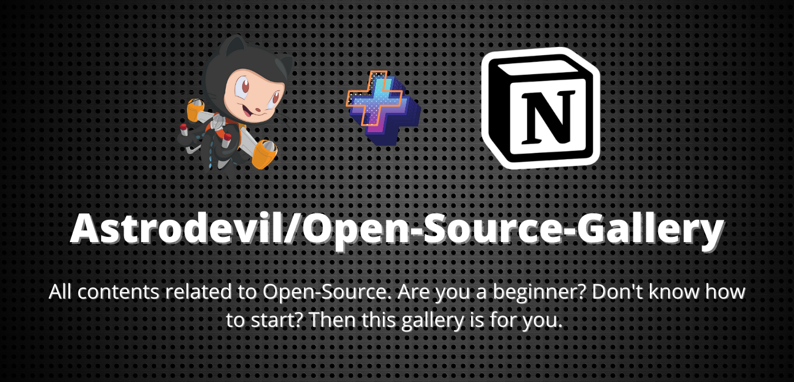

<h1 align="center">Open-Source-Gallery📚</h1>
<p align="center">
 <a href="https://astrodevil.github.io/Open-Source-Gallery/">
    
  </a>
 </p>


**[All contents related to Open-Source.](https://astrodevil.github.io/Open-Source-Gallery/)**

<div align="center">
   
 


[](https://github.com/Astrodevil/Open-Source-Gallery)
[](https://github.com/Astrodevil/Open-Source-Gallery)
[](https://github.com/Astrodevil/Open-Source-Gallery)

</div>

## About❓
Wants to start open-source? Are you a beginner? Don't know how, where, why to start?

You are welcome! You are in right place.😊

Open-Source-Gallery provides you with all the resources needed to become a good open-source contributor, project maintainer & developer.

The motive🎯 of this project is to help new learners like you to get familiar with the world of open-source.

Happy learning.👍

**So, What are you waiting for? [Start here](https://astrodevil.github.io/Open-Source-Gallery/)**

## Contributing Guidelines📝
<details>
<summary>Click to view👀</summary> 

Thank you for your interest to make this resource useful! Pull requests are welcome. For major changes, please open an issue first to discuss what you would like to add.

To start contributing, follow the below guidelines: 

**1.**  **Star** and **Fork** [this](https://github.com/Astrodevil/Open-Source-Gallery) repository.

**2.**  Clone your forked copy of the project.

```
git clone https://github.com/<your_user_name>/Open-Source-Gallery.git
```

**3.** Navigate to the project directory :file_folder: .

```
cd Open-Source-Gallery
```

**4.** Add a reference(remote) to the original repository.

```
git remote add upstream https://github.com/Astrodevil/Open-Source-Gallery.git 
```

**5.** Check the remotes for this repository.

```
git remote -v
```

**6.** Always take a pull from the upstream repository to your master branch to keep it at par with the main project(updated repository).

```
git pull upstream main
```

**7.** Create a new branch.

```
git checkout -b <your_branch_name>
```

**8.** Perfom your desired changes to the code base.

**9.** Track your changes:heavy_check_mark: .

```
git add . 
```

**10.** Commit your changes .

```
git commit -m "Relevant message"
```

**11.** Push the committed changes in your feature branch to your remote repo.

```
git push -u origin <your_branch_name>
```

**12.** To create a pull request, click on `compare and pull requests`.

**13.** Add appropriate title and description to your pull request explaining your changes and efforts done.

**14.** Click on `Create Pull Request`.


**15.** Woohoo! You have made a PR to the Open-Source-Gallery :boom: . Wait for your submission to be accepted and your PR to be merged.

**Thank you for your interest in contributing to our Repo!🏼**

**Kudos to you🎈**
  
</details>


## My Stars⭐
- [🧑‍💻 Learning Resources](https://github.com/stars/Astrodevil/lists/learning-resources)
- [🎉 Useful](https://github.com/stars/Astrodevil/lists/useful)
- [🔮 Future Ideas](https://github.com/stars/Astrodevil/lists/future-ideas)
- [✨ Inspiration](https://github.com/stars/Astrodevil/lists/inspiration)
- [🤖 Cool Actions](https://github.com/stars/Astrodevil/lists/cool-actions)

  
## This Will Help🌩️

- *Why clone everything to the machine? Just press "." (dot) after opening the forked repo in a browser tab. See the Magic!🎉*
- *Want to preview your live changes? Copy and paste the project.html URL into [GitHack](https://raw.githack.com/). You will get 2 URLs for production and development, copy and paste them into a new tab. See the Magic!🎉*
  

## License🛡️
This project is licensed under the MIT License - see the [`LICENSE`](LICENSE) file for details.

  ## Project Admin🕵🏼‍♂

<table>
<tbody><tr>
<td align="center"><a href="https://github.com/Astrodevil"><br><sub><b> Mr. Ånand </b></sub></a><br><a href="https://github.com/ZeroOctave/ZeroOctave-Javascript-Projects/commits?author=Astrodevil" title="Code">🌝💻 </a></td> </a></td>
</table>
  
## Support☕
This project has a purpose to help newbies to get into open-source. Don't forget to leave a star ⭐️

If you found this helpful, consider supporting me by buying me a coffee.

<a href="https://www.buymeacoffee.com/Astrodevil">

</a>


### Best of luck for your open-source journey👍😊
